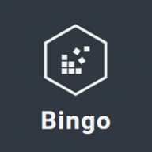
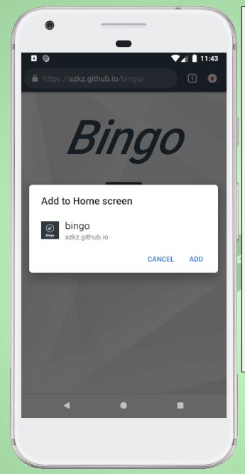
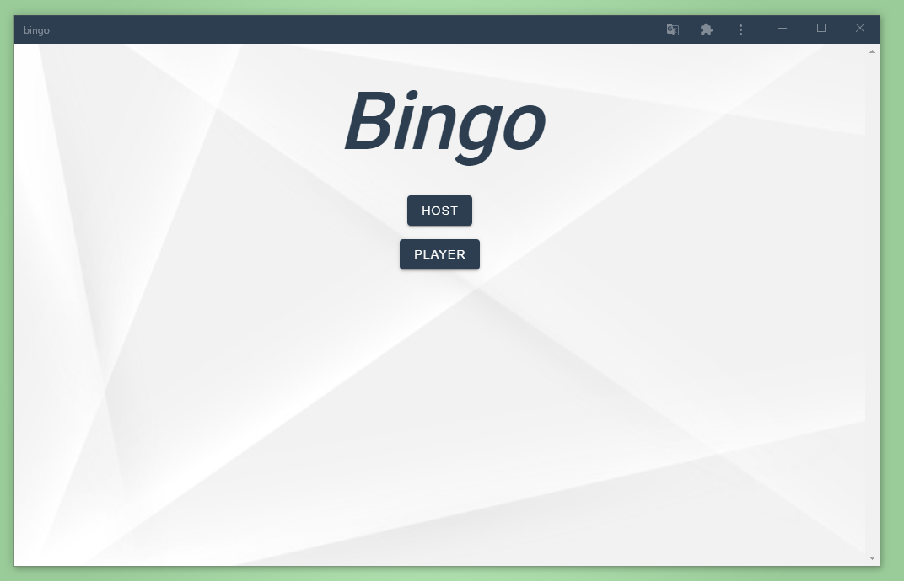
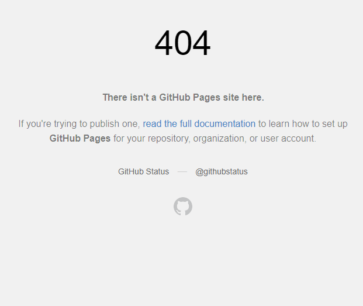

5 週間で Web サービスをリリース人集まれ@新宿もくもく会

# 初めてのVue.js で PWA の [ビンゴゲーム](https://azkz.github.io/bingo/)を作った話

---

# 自己紹介
## 名前：あぜがみ
## 年齢：25歳
## 仕事：中小SES企業(保守運用)
## 言語：JavaとKotlinをほんの少し

---

# 参加の動機
- フロントエンドの技術を使って、何か作りたかった。
- 前回のこの企画のLTを聞いてみて、皆さん楽しそうだった。
<br>
### 作るなら公開した方が絶対いいよな...
## コロナ禍で時間もあるし参加しちゃえ！

---

# 技術スタック

### フロントエンド
- Vue.js
  - Vuetify(CSSフレームワーク)
  - Vue Router(URLルーティング)
  - idb(indexdDBの便利ライブラリ) &emsp; など

### バックエンド
- 無し

### インフラ
- Github Pages
  - **無料** かつ **HTTPS化**なので静的Webサイトの公開には**非常におすすめ！**
    - でも、若干ハマったので、後述します。


---

# 機能説明
## デモ
https://azkz.github.io/bingo/



---

# 解決できる課題

- ビンゴカードの購入
- ビンゴカードの配布、片付け
- 数字を抽選する仕組みの準備
- 抽選された数字の記録

# **これらの作業で発生するコスト・手間を排除できる！**

---

さらに、

# アプリ・会員登録不要

# 通信状況の影響を受けない(PWA)

# オンラインでも楽しめる

# 人数制限無し

# 完全無料

---

# PWAって？
### Progressive Web Apps のこと
<br>

- Webアプリがスマホアプリのように使える
  - オフラインでも動く
  - プッシュ通知を受け取れる
<br>

しかも、
### アプリストアを通さなくてもよい！
### Webの技術だけでOK！

---
# 今回作ったビンゴゲームでも
## インストールできる
 

---
## 若干見た目がネイティブアプリっぽくなる
### オフラインでも使える

 

---

# 良かった点

- 想像以上にSPAを**簡単**に**楽しく**作ることができた。
  - 他のReactやAngularは触ったことないが、Vueは噂通り手軽だと感じた。
<br>
- サービスとしてリリースできた**達成感**を感じられた。
  - 自分で思い描いていたものを形にできた。
  - (需要があるかはさておき)サービスによって**解決できる課題**がある。
<br>
- 一応、PWAにすることもできた。
  - Vue CLIでプロジェクト作成時に選択しただけ、驚くほど簡単。
    - (実際、PWAである必要性は感じていない。)

---

# 反省する点

- ほとんどコンポーネント化していない。
  - 1 画面 1 ファイルの状態。
  - **拡張性**が低い。
<br>
- 変更が難しい。
  - テストコードが無い。
  - **手を加えたいとは思えない**。
<br>
- Vueの基礎を抑えられていない。
  - 動けば良しのところがたくさん。
  - 状態管理とかわかってない。

---

# まとめ

- **初めての技術でも**ググれば、動くモノ自体は作れると改めて実感。
- しかし、**品質の高い**コードを書くには、**設計手法を学び**、
それを生かして、**もっとコードを書く**必要がある。

---

# ハマったポイント
## 事象：URLから参加できるようにしたが、404になってしまう:scream:
 &emsp;&emsp;&emsp;&emsp;&emsp; 
本来はサーバーの設定で解決するらしい [(公式ドキュメント)](https://router.vuejs.org/ja/guide/essentials/history-mode.html#%E3%82%B5%E3%83%BC%E3%83%90%E3%83%BC%E3%81%AE%E8%A8%AD%E5%AE%9A%E4%BE%8B)
→でも、Github Pagesだからサーバーとかない...

---

# 解決策
1. 自前で404.htmlを用意
2. sessionStorageにアクセスしたパスとパラメータを格納
3. ルートパスにリダイレクトさせる

404.html
```html
<!DOCTYPE html>
<html lang="en">
  <head>
    <script>
      // URL直打ち時に404画面を出さないために
      // sessionStorageにパスとパラメーターを保存して
      // ルートパスにリダイレクトする
      sessionStorage.redirectPathname = location.pathname
      sessionStorage.redirectParamater = location.search
    </script>
    <meta http-equiv="refresh" content="0;URL=./"></meta>
  </head>
</html>
```

---

4. App.vueのcreatedフックでsessionStorageの中身を取り出す
5. Vue Routerを使って、遷移させる

App.vue
```javascript
<script>
export default {
  name: 'App',
  created: function () {
    // 404.htmlで保管された値を取得する
    const redirectPathname = sessionStorage.redirectPathname
    const redirectParamater = sessionStorage.redirectParamater
    console.log('redirectPathname:' + redirectPathname)
    console.log('redirectParamater:' + redirectPathname)

    // 取得できたため、削除する
    delete sessionStorage.redirectPathname
    delete sessionStorage.redirectParamater

    // URL直打ちリダイレクトされているようなら、そのパスにvue-routerで遷移する
    if (redirectPathname && redirectPathname !== location.pathname) {
      const pushPath = redirectPathname.replace(process.env.BASE_URL, '/') + redirectParamater
      console.log('pushPath:' + pushPath)
      this.$router.push(pushPath)
    }
  }
}
</script>

```

---

# 終わり

<br>

# ありがとうございました！
